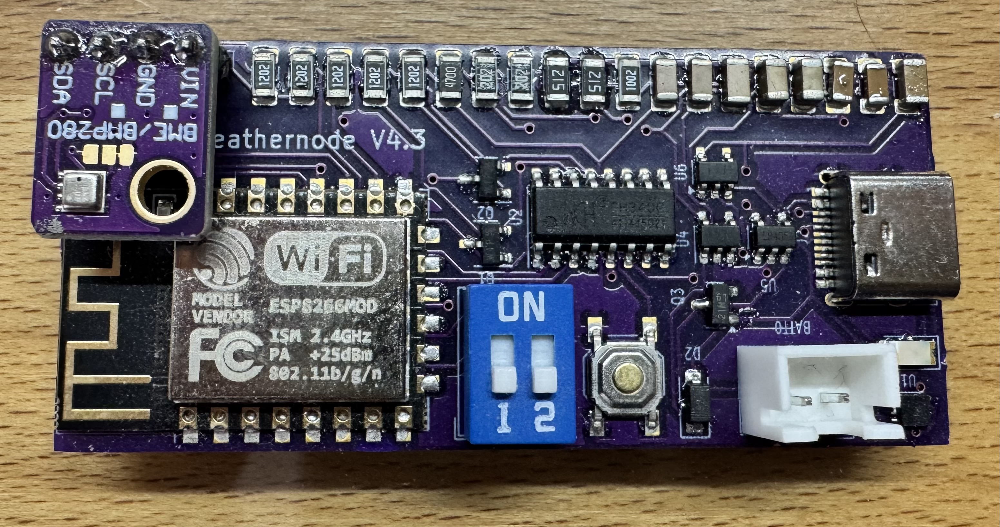
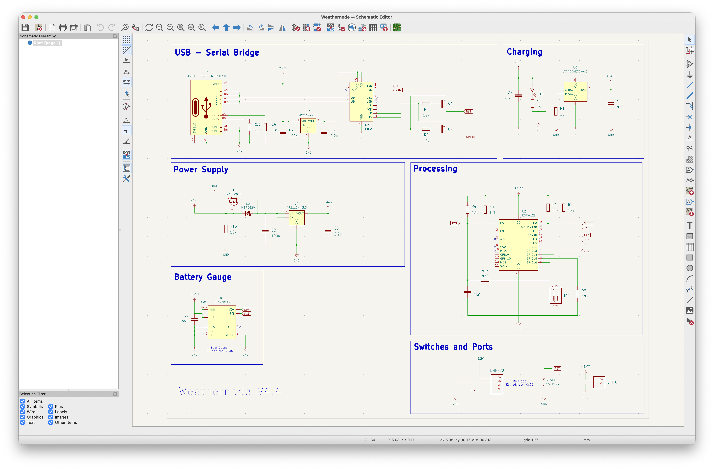
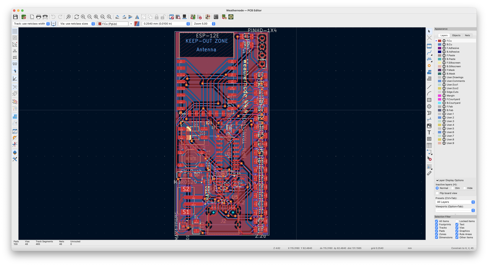
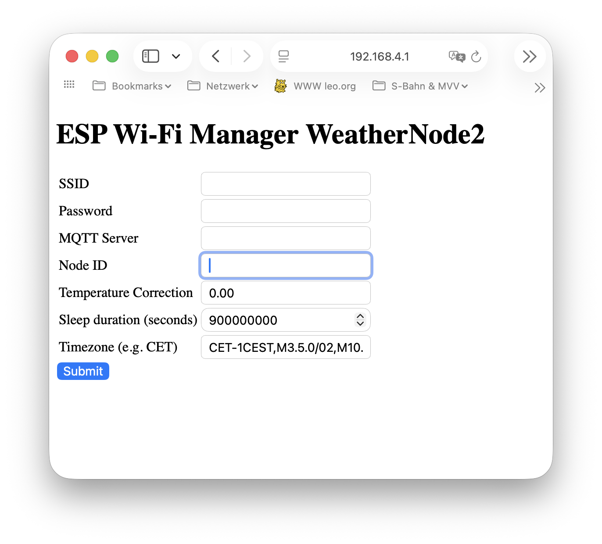
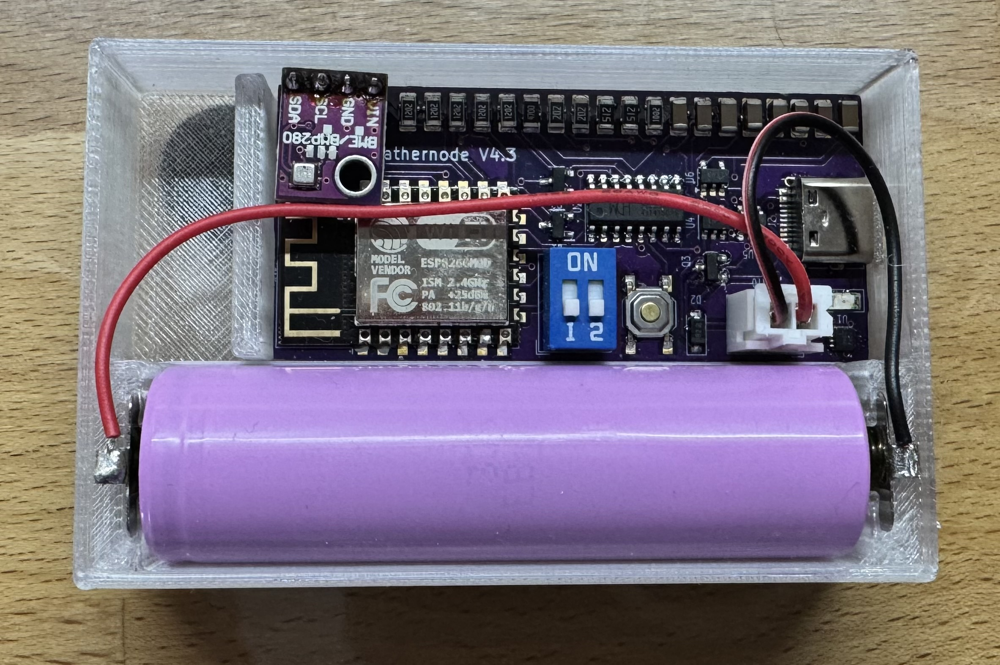
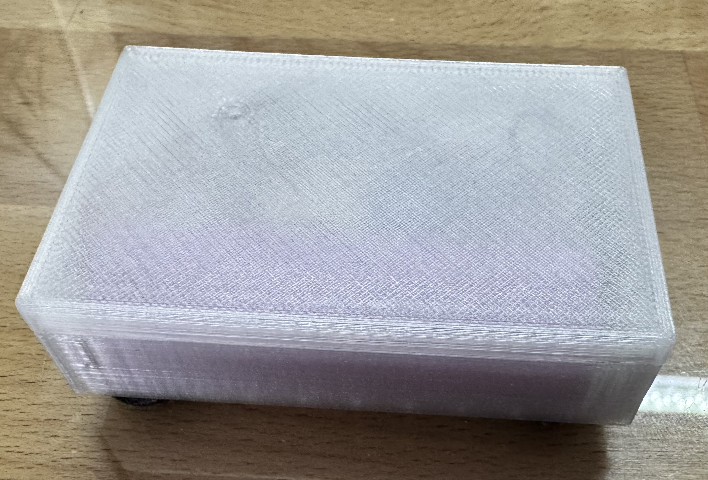

# WeatherNodeV4

WeatherNode is a small HW device based on ESP8266 to capture actual weather conditions as temperature, pressure and humidity.
The data is send via Wifi to a MQTT broker.
The back office SW is stored in

https://github.com/Michil783/Store_MQTT_Data_in_Database

for the MQTT to DB service and in

https://github.com/Michil783/dhtWebHist

for a web interface to access the DB content.
Both applications could run on a Raspberry Pi together with the MQTT broker.

For displaying the data I created a web page using the Astro framework based on an other github project.
More details could be found here: 

https://github.com/Michil783/weather-forecast

## Hardware

The hardware schema is done in KiCAD and could be found in https://github.com/michil783/WeatherNodeV4/PCB

As weather sensor the Arduino Sensor Board BMP280 is used. For battery charging and programming a USB-C connector is onboard.

The PCB layout is also done with KiCAD and could also be found in this folder.

After taking the meassurements it goes to a deep sleep for 15 minutes and restart again for the next meassurement.

With a 18650 LiIon battery with ~3500mAh capacity you get a working time up to 8-10 weeks before you need to recharge the battery.

### Details of the hardware

#### USB controller
The USB controller is a CH340C

#### Charging controller
For charging and battery controlling the LTC4054 is used. It is configured to use about 500mA.

#### Battery watching
To get the current state of charge and the battery voltage a MAX17048 chip is used. It provides all necessary information.

#### Weather Sensor
To get all necessary climate values the BOSCH BMP280 circuit from Arduino is used.

#### CPU
As CPU the ESP8266 board is used. Wifi and I2C interfaces are already onboard.

## Software

The system provides a Wifi AP for the first installation. The AP name is "WeatherNode-Wifi-Manager" with an IP of 192.168.4.1. Accessing this IP from a browser you get the manager to configure the WeatherNode into your Wifi and with a proper ID.

When the WeatherNode is used the first time and no settings are stored via the programming the Wifi Manager starts automatically.

Via the DIP switches you could reset these settings on the board and restart the Wifi Manager.
With DIP switch 2 you do a reset and DIP switch 1 is starting the Wifi Manager without reseting the data.

When settings are available, the node starts up and is connectiong to the specified Wifi and to the MQTT broker. After this it initializes all components on the board and waits for 2 seconds before reading the data from the weather sensor. This is done to warmup the sensor to get a more precise measurement.

After taking the measurement it creates a JSON package and sends it to the MQTT broker.

If transmission of packet is successful it goes to a deep sleep for 15 minutes and the cycle begins again with a restart of the node.

## Housing

In the folder Box is a construction for a box for the WeatherNode including space for a 18650 battery.

